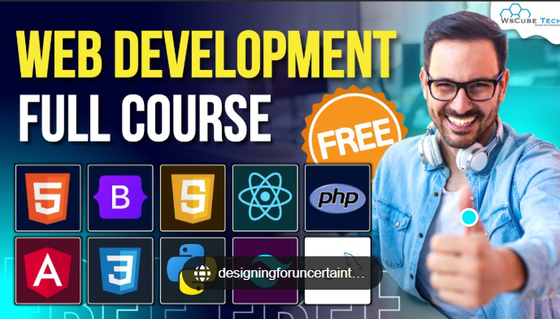
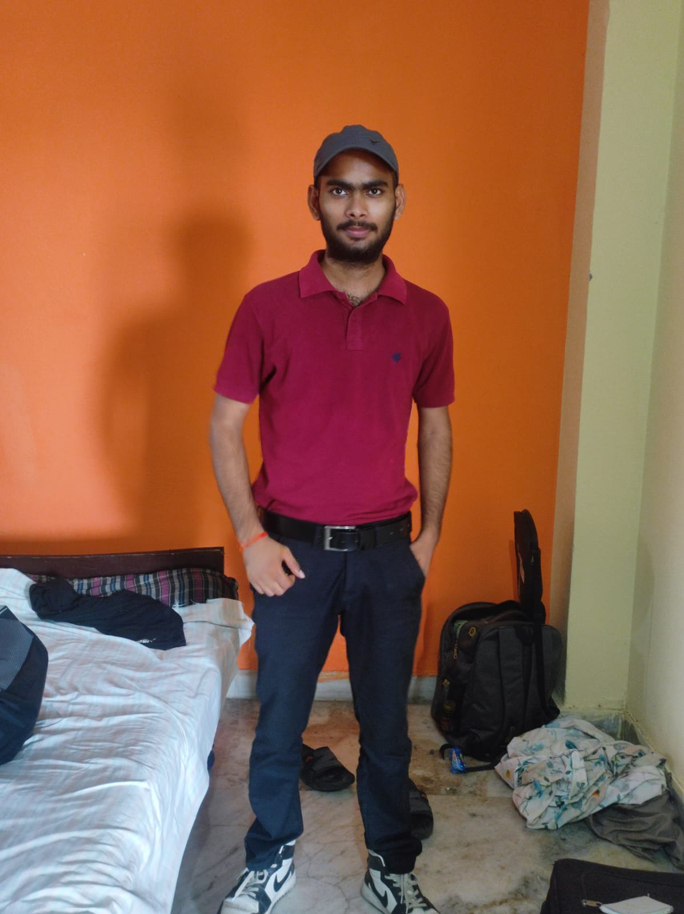

# 🎓 EduFlow - Advanced Learning Management System

  
  
  
  
  
  
  
  **A modern, feature-rich Learning Management System built with cutting-edge technologies**
  
  [🚀 Live Demo](#) • [📖 Documentation](#features) • [🐛 Report Bug](https://github.com/01Anshuman/Advance_lms/issues) • [✨ Request Feature](https://github.com/01Anshuman/Advance_lms/issues)

---

## 🌟 About EduFlow

EduFlow is a comprehensive Learning Management System designed to revolutionize online education. Built by the **TechiSpider Team**, it provides an intuitive platform for students, instructors, and administrators to create, manage, and participate in online learning experiences.

### 🎯 Mission
To make quality education accessible to everyone, everywhere through innovative technology solutions that empower learners and educators alike.

---

## ✨ Features

### 🎓 **For Students**
- **Interactive Dashboard** - Track progress, view enrolled courses, and manage learning goals
- **Course Catalog** - Browse and filter courses by category, level, and rating
- **Video Learning** - High-quality video lessons with playback controls
- **Progress Tracking** - Real-time progress monitoring and achievement badges
- **Certificates** - Earn certificates upon course completion
- **Mobile Responsive** - Learn anywhere, anytime on any device

### 👨‍🏫 **For Instructors**
- **Course Creation** - Easy-to-use course builder with multimedia support
- **Student Analytics** - Track student engagement and performance
- **Content Management** - Upload videos, documents, and interactive content
- **Quiz Builder** - Create assessments and quizzes
- **Communication Tools** - Direct messaging and announcements

### 🔧 **For Administrators**
- **User Management** - Manage students, instructors, and permissions
- **Analytics Dashboard** - Comprehensive platform analytics
- **Content Moderation** - Review and approve course content
- **System Configuration** - Customize platform settings and branding

### 🎨 **Design & UX**
- **Modern UI/UX** - Clean, intuitive interface with smooth animations
- **Dark/Light Mode** - Toggle between themes for comfortable viewing
- **Accessibility** - WCAG compliant design for inclusive learning
- **Responsive Design** - Optimized for desktop, tablet, and mobile devices

---

## 🛠️ Tech Stack

### **Frontend**
- **Framework**: Next.js 14 (App Router)
- **Language**: TypeScript
- **Styling**: Tailwind CSS
- **UI Components**: Radix UI + shadcn/ui
- **Animations**: Framer Motion
- **Icons**: Lucide React
- **Charts**: Recharts

### **Backend & Database**
- **Runtime**: Node.js
- **Authentication**: NextAuth.js (Ready for integration)
- **Database**: Ready for PostgreSQL/MongoDB integration
- **File Storage**: Ready for cloud storage integration

### **Development Tools**
- **Package Manager**: npm/yarn
- **Linting**: ESLint
- **Formatting**: Prettier
- **Version Control**: Git

---

## 🚀 Quick Start

### Prerequisites
- Node.js 18+ 
- npm or yarn
- Git

### Installation

1. **Clone the repository**
   \`\`\`bash
   git clone https://github.com/01Anshuman/Advance_lms.git
   cd Advance_lms
   \`\`\`

2. **Install dependencies**
   \`\`\`bash
   npm install
   # or
   yarn install
   \`\`\`

3. **Run the development server**
   \`\`\`bash
   npm run dev
   # or
   yarn dev
   \`\`\`

4. **Open your browser**
   Navigate to [http://localhost:3000](http://localhost:3000)

### 🔑 Demo Credentials
- **Student Account**: `demo@eduflow.com` / `demo123`
- **Admin Account**: `admin@eduflow.com` / `admin123`

---

## 📁 Project Structure

\`\`\`
Advance_lms/
├── 📁 app/                    # Next.js App Router pages
│   ├── 📁 (auth)/            # Authentication pages
│   ├── 📁 courses/           # Course-related pages
│   ├── 📁 dashboard/         # User dashboard
│   ├── 📁 learn/             # Learning interface
│   └── 📄 layout.tsx         # Root layout
├── 📁 components/            # Reusable UI components
│   ├── 📁 ui/               # shadcn/ui components
│   └── 📁 layout/           # Layout components
├── 📁 contexts/             # React contexts
├── 📁 lib/                  # Utility functions
├── 📁 public/               # Static assets
│   └── 📁 images/           # Course and team images
├── 📁 styles/               # Global styles
└── 📄 README.md             # Project documentation
\`\`\`

---

## 🎨 Screenshots

  
  

---

## 👥 Meet the TechiSpider Team

  <table>
    <tr>
      <td align="center">
         
        <b>Anshuman Mishra</b> 
        Full Stack Developer
      </td>
      <td align="center">
         
        <b>Saurabh Dwivedi</b> 
        Frontend Specialist
      </td>
      <td align="center">
         
        <b>Preeti</b> 
        Backend Developer
      </td>
      <td align="center">
         
        <b>Prateek</b> 
        DevOps Engineer
      </td>
    </tr>
  </table>

### 🌟 Our Values
- **Innovation**: Pushing the boundaries of educational technology
- **Collaboration**: Working together to create meaningful learning experiences
- **Excellence**: Committed to delivering high-quality, user-focused platforms
- **Passion**: Driven by our love for technology and education

---

## 🚀 Deployment

### Vercel (Recommended)
1. Push your code to GitHub
2. Connect your repository to [Vercel](https://vercel.com)
3. Deploy with zero configuration

### Other Platforms
- **Netlify**: Connect GitHub repo and deploy
- **Railway**: One-click deployment from GitHub
- **Docker**: Use the included Dockerfile for containerization

---

## 🤝 Contributing

We welcome contributions from the community! Here's how you can help:

### 🐛 Reporting Bugs
1. Check existing issues first
2. Create a detailed bug report
3. Include steps to reproduce

### ✨ Suggesting Features
1. Open a feature request issue
2. Describe the feature and its benefits
3. Discuss implementation approaches

### 💻 Code Contributions
1. Fork the repository
2. Create a feature branch (`git checkout -b feature/amazing-feature`)
3. Commit your changes (`git commit -m 'Add amazing feature'`)
4. Push to the branch (`git push origin feature/amazing-feature`)
5. Open a Pull Request

### 📋 Development Guidelines
- Follow TypeScript best practices
- Use conventional commit messages
- Add tests for new features
- Update documentation as needed

---

## 📄 License

This project is licensed under the MIT License - see the [LICENSE](LICENSE) file for details.

---

## 📞 Contact & Support

### 📧 Get in Touch
- **Email**: contact@eduflow.com
- **Phone**: +91 9956888757
- **Address**: Noida Sector-3, Rajni Gandha Chawk

### 🔗 Links
- **Website**: [EduFlow Platform](#)
- **Documentation**: [API Docs](#)
- **Support**: [Help Center](#)

### 💬 Community
- **GitHub Discussions**: [Join the conversation](https://github.com/01Anshuman/Advance_lms/discussions)
- **Issues**: [Report bugs or request features](https://github.com/01Anshuman/Advance_lms/issues)

---

## 🙏 Acknowledgments

- **shadcn/ui** for the beautiful UI components
- **Vercel** for the amazing deployment platform
- **Next.js team** for the incredible framework
- **Open source community** for inspiration and tools

---

## 📈 Roadmap

### 🎯 Phase 1 (Current)
- [x] Core LMS functionality
- [x] User authentication system
- [x] Course management
- [x] Responsive design
- [x] Dark/Light mode

### 🚀 Phase 2 (Upcoming)
- [ ] Real-time chat and discussions
- [ ] Advanced analytics dashboard
- [ ] Mobile app development
- [ ] AI-powered course recommendations
- [ ] Integration with payment gateways

### 🌟 Phase 3 (Future)
- [ ] Virtual classroom with video conferencing
- [ ] Advanced assessment tools
- [ ] Gamification features
- [ ] Multi-language support
- [ ] API for third-party integrations

---

  <h3>🚀 Built with ❤️ by TechiSpider Team</h3>
  
<em>Innovating Education Technology, One Line of Code at a Time</em>

  
  ⭐ **Star this repository if you found it helpful!** ⭐

